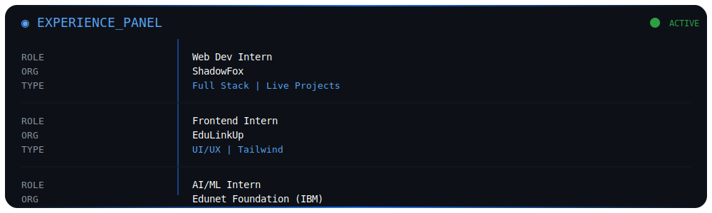

  

  

##  Socials

  
  
  
  

---

##  About Me

🎓 CS @ **VIT Bhopal**  
💻 Building full-stack apps & smart automation tools  
🤖 Interested in **AI, NLP & scalable systems**  
🧠 Love turning ideas → working products  

---

## When I code, I rely on

  
  
  
  
  

  
  
  
  
  

  
  
  
  
  

---

## 📊 GitHub Stats

  
  

---

 Projects
<table> <tr> <td width="25%" valign="top">
🤖 JARVIS

Offline AI assistant with voice automation & system control

</td> <td width="25%" valign="top">
✈️ AVIPRO

Full-stack travel booking platform with CMS

</td> <td width="25%" valign="top">
🔍 CodeScope

CLI tool for code structure & maintainability metrics

</td> <td width="25%" valign="top">
📓 FailForward

Reflection app to log mistakes & extract insights

</td> </tr> </table>

---

---

 Achievements

      

---

